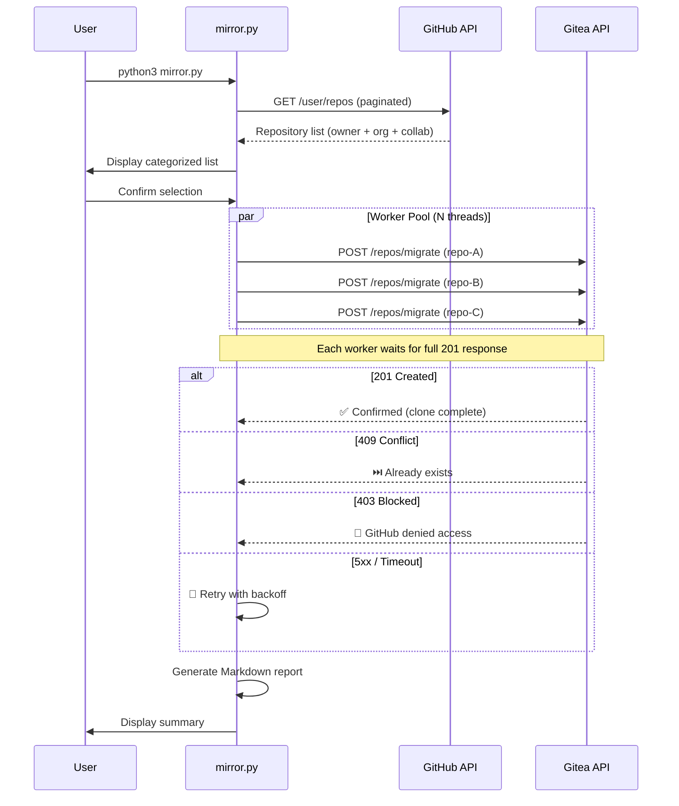

<div align="center">

# 🪞 Gitea GitHub Mirror

**Bulk mirror all your GitHub repositories to a self-hosted Gitea instance — concurrent, strict, reliable.**

[](LICENSE)
[](https://python.org)
[](Dockerfile)
[](https://github.com/yuanweize/Gitea-GitHub-Mirror/pkgs/container/gitea-github-mirror)
[](https://github.com/yuanweize/Gitea-GitHub-Mirror/actions)
[](mirror.py)

[English](#-overview) · [简体中文](README_CN.md)

---

*One command. All repos. Concurrent workers. Strict 201 validation. Zero false positives.* ✨

</div>

---

## 📖 Overview

**Gitea GitHub Mirror** is a zero-dependency Python CLI tool that discovers every repository under your GitHub account — public, private, forked, organization, and collaborator repos — and creates **pull-mirror clones** on your self-hosted [Gitea](https://gitea.io) instance.

Once configured, Gitea will **automatically sync** from GitHub on a schedule (default: every 8 hours), keeping your self-hosted backup always up-to-date without any manual intervention.

### ✨ Key Features

| Feature | Description |
|---------|-------------|
| 🔍 **Auto-Discovery** | Scans all repos via GitHub API (owner + org + collaborator) |
| 🧲 **Incremental Sync** | Skips healthy repos on Gitea; auto-repairs broken mirrors |
| 🔧 **Mirror Health Check** | Detects empty shells from failed migrations and auto-deletes them |
| 🪞 **Pull Mirror** | Creates Gitea pull-mirrors that auto-sync periodically |
| ⚡ **Concurrent Workers** | Multi-threaded execution (configurable `MAX_WORKERS`) — N repos migrate in parallel |
| ✅ **Strict Validation** | Only HTTP 201 = success. No guessing, no false positives |
| 🚫 **Blocked Repo Detection** | Auto-detects GitHub 403 (DMCA/TOS) and skips cleanly |
| 🌍 **Bilingual i18n** | Full English and 简体中文 interface |
| 🔄 **Retry + Backoff** | Exponential backoff on 5xx and network errors |
| 📊 **Execution Reports** | Markdown reports with timing, concurrency stats, auto-archived |
| 📝 **Structured Logging** | Thread-safe dual output: console + timestamped log files |
| 🐳 **Docker Ready** | Alpine-based image, Docker Compose, GitHub Actions CI/CD |
| 🔐 **Secure by Design** | `.env` file for secrets, non-root Docker user |
| 📁 **Auto-Rotation** | Old logs (max 30) and reports (max 50) automatically pruned |
| ⚙️ **Graceful Shutdown** | Ctrl+C triggers clean exit — finishes in-flight tasks, generates report |
| ⚡ **Zero Dependencies** | Pure Python 3 stdlib — no `pip install` needed |

> **💡 v2.2.0 Highlights:** Mirror health check with auto-repair for broken shells, post-failure cleanup to prevent ghost repos.

---

## 🚀 Quick Start

### 🚀 Which deployment is right for you?

| Method | Best for | Server needed? |
|--------|----------|----------------|
| 🐍 [Python](#option-1-run-directly-recommended-for-first-time) | First-time / quick test | Any machine with Python 3 |
| 🐳 [Docker Compose](#option-2-docker-compose-recommended-for-persistent-deployment) | Self-hosted persistent | Docker host |
| 📦 [Docker CLI](#option-3-docker-one-liner) | One-off containerized run | Docker host |
| ☁️ [GitHub Actions](#option-4-github-actions-recommended-for-hands-free-automation) | Fully automated, no server | None (free) |

### Option 1: Run Directly (Recommended for first-time use)

```bash
# 1. Clone the project
git clone https://github.com/yuanweize/Gitea-GitHub-Mirror.git
cd Gitea-GitHub-Mirror

# 2. Configure
cp .env.example .env
# Edit .env with your tokens and URLs (see Configuration below)

# 3. Run (interactive mode)
python3 mirror.py

# 3a. Or run non-interactively
python3 mirror.py --yes
```

### Option 2: Docker Compose (Recommended for persistent deployment)

```bash
# 1. Clone and configure
git clone https://github.com/yuanweize/gitea-github-mirror.git
cd gitea-github-mirror
cp .env.example .env
# Edit .env

# 2a. Run in foreground (see live output)
docker compose up

# 2b. Run in background (detached / persistent)
docker compose up -d

# 3. Check logs when running in background
docker compose logs -f
```

### Option 3: Docker (One-liner)

```bash
# Foreground (see output directly)
docker run --rm \
  --env-file .env \
  -v ./logs:/app/logs \
  -v ./reports:/app/reports \
  ghcr.io/yuanweize/gitea-github-mirror:latest

# Background (persistent, detached)
docker run -d --name gitea-mirror \
  --restart unless-stopped \
  --env-file .env \
  -v ./logs:/app/logs \
  -v ./reports:/app/reports \
  ghcr.io/yuanweize/gitea-github-mirror:latest
```

### Option 4: GitHub Actions (Recommended for hands-free automation)

**No server needed.** GitHub runs the script for you on a schedule.

1. **Fork or clone** this repo to your GitHub account
2. **Add secrets** in your repo: `Settings → Secrets and variables → Actions → New repository secret`

   | Secret Name | Value |
   |-------------|-------|
   | `GITEA_URL` | `https://git.example.com` |
   | `GITEA_TOKEN` | Your Gitea API token |
   | `GITEA_USER` | Your Gitea username |
   | `MIRROR_GITHUB_TOKEN` | Your GitHub PAT with `repo` scope |
   | `GITHUB_USER` | Your GitHub username |
   | `SKIP_REPOS` | Comma-separated list of repository names to strictly ignore |
   | `MIRROR_INTERVAL` | Synchronization interval (e.g. `8h0m0s`) |
   | `MIRROR_EXTRAS` | Set to `true` to migrate issues, wiki, labels, releases, and milestones |
   | `PRESERVE_ORGS` | Set to `true` to automatically recreate GitHub organizations in Gitea |
   | `SYNC_NOW` | Set to `true` to immediately trigger a mirror sync for existing repositories |
   | `FORCE_RECREATE` | Set to `true` to force delete and remigrate existing repositories (WARNING: Dangerous!) |

   > **⚠️ Important:** The GitHub token secret is named `MIRROR_GITHUB_TOKEN` (not `GITHUB_TOKEN`) because `GITHUB_TOKEN` is reserved by GitHub Actions.

3. **Run it:**
   - **Manually:** Go to `Actions` tab → `Mirror Sync` → `Run workflow`
   - **Automatically:** Runs every Sunday at 03:00 UTC by default (configurable in the workflow file)

4. **View results:** Reports and logs are uploaded as **workflow artifacts** after each run (retained for 30 and 7 days respectively)

<details>
<summary><strong>📝 Customize the schedule</strong></summary>

Edit `.github/workflows/mirror-sync.yml` and change the cron expression:

```yaml
schedule:
  - cron: "0 3 * * 0"    # Weekly (Sunday 03:00 UTC) — default
  # - cron: "0 3 * * *"  # Daily at 03:00 UTC
  # - cron: "0 */6 * * *" # Every 6 hours
```

</details>

---

## ⚙️ Configuration

All configuration is done via environment variables. Copy `.env.example` to `.env` and fill in your values.

### Required Variables

| Variable | Description | Example |
|----------|-------------|---------|
| `GITEA_URL` | Your Gitea instance base URL | `https://git.example.com` |
| `GITEA_TOKEN` | Gitea API access token | `abc123...` |
| `GITEA_USER` | Gitea username (repo owner) | `myuser` |
| `GITHUB_TOKEN` | GitHub personal access token | `ghp_xxx...` |
| `GITHUB_USER` | GitHub username | `myuser` |

### Optional Variables

| Variable | Default | Description |
|----------|---------|-------------|
| `MIRROR_INTERVAL` | Server default | Sync interval (e.g., `8h0m0s`) |
| `MIRROR_EXTRAS` | `false` | Migrate issues, wiki, labels, and releases (`true`/`false`) |
| `PRESERVE_ORGS` | `false` | Automatically recreate GitHub organizations in Gitea (`true`/`false`) |
| `SYNC_NOW` | `false` | Immediately trigger mirror sync for existing repos (`true`/`false`) |
| `FORCE_RECREATE` | `false` | Force delete and remigrate existing repos (`true`/`false`, dangerous) |
| `MIRROR_LFS` | `false` | Enable Git LFS during mirror migration (`true`/`false`) |
| `NOTIFY_WEBHOOK` | *(empty)* | Webhook URL for notifications (Slack/Discord/Teams/Feishu/DingTalk/Telegram/etc) |
| `NOTIFY_TYPE` | *(auto)* | Force webhook type: `slack`, `discord`, `teams`, `feishu`, `dingtalk`, `telegram`, `generic` |
| `NOTIFY_CHAT_ID` | *(empty)* | Telegram chat_id (required when using Telegram webhook) |
| `NOTIFY_ONLY_ON_FAILURE` | `false` | Send notifications only when failures occur (`true`/`false`) |
| `NOTIFY_INCLUDE_REPORT` | `false` | Include report content in notifications (`true`/`false`) |
| `MAX_WORKERS` | `5` | Concurrent worker threads. Each waits for full HTTP 201 |
| `REQUEST_TIMEOUT` | `600` | HTTP timeout per request (seconds). Must cover the largest repo clone time |
| `MAX_RETRIES` | `3` | Max retry attempts per repo on transient errors |
| `RETRY_DELAY` | `10` | Initial retry delay (seconds), exponential backoff |
| `LOG_LEVEL` | `INFO` | `DEBUG`, `INFO`, `WARNING`, `ERROR` |
| `REPORT_MAX_COUNT` | `50` | Max archived reports before auto-rotation |
| `LANG_MIRROR` | `en` | UI language: `en` or `cn` |

### Generating Tokens

<details>
<summary><strong>🔑 GitHub Token</strong></summary>

1. Go to [github.com/settings/tokens](https://github.com/settings/tokens)
2. Click **Generate new token (classic)**
3. Select scope: **`repo`** (full control — required for private repos)
4. Copy the generated token to `GITHUB_TOKEN` in your `.env`

</details>

<details>
<summary><strong>🔑 Gitea Token</strong></summary>

1. Go to `https://your-gitea-instance/user/settings/applications`
2. Under **Manage Access Tokens**, enter a token name
3. Click **Generate Token**
4. Copy the token to `GITEA_TOKEN` in your `.env`

</details>

---

## 📋 CLI Usage

```
usage: mirror.py [-h] [--lang {en,cn}] [--yes] [--include-orgs] [--dry-run]
                 [--workers N] [--timeout SECONDS]

Bulk mirror all GitHub repos to Gitea (concurrent, strict).

options:
  -h, --help            show this help message and exit
  --lang {en,cn}        UI language (en/cn)
  --yes, -y             Skip all confirmation prompts
  --include-orgs        Include organization & collaborator repos
  --dry-run             Simulate without making any API calls to Gitea
  --workers N           Concurrent worker threads (default: 5)
  --timeout SECONDS     HTTP request timeout in seconds (default: 600)
```

### Examples

```bash
# Interactive mode (default) — lists repos, asks for confirmation
python3 mirror.py

# Chinese interface
python3 mirror.py --lang cn

# Non-interactive, owner repos only
python3 mirror.py --yes

# Include org repos, no prompts, Chinese UI
python3 mirror.py --yes --include-orgs --lang cn

# Dry run — preview what would happen without touching Gitea
python3 mirror.py --dry-run

# 10 concurrent workers with longer timeout
python3 mirror.py --workers 10 --timeout 900
```

---

## 🏗️ Project Structure

```
gitea-github-mirror/
├── mirror.py                    # Main application (single-file, zero deps)
├── .env.example                 # Environment variable template
├── Dockerfile                   # Minimal Alpine-based Docker image
├── docker-compose.yml           # Docker Compose with optional cron scheduler
├── .gitignore                   # Git ignore rules
├── LICENSE                      # MIT License
├── README.md                    # Documentation (you are here)
├── logs/                        # Runtime logs (auto-rotated, max 30 files)
│   └── mirror_20260527_134500.log
├── reports/                     # Execution reports (auto-rotated, max 50 files)
│   └── report_20260527_134500.md
└── .github/
    └── workflows/
        ├── docker-publish.yml   # CI/CD: auto-build & push to GHCR
        └── mirror-sync.yml      # Scheduled/manual mirror execution
```

---

## ⚡ Concurrency Model

A core architectural decision of this tool.

### The Problem

Gitea's migration API (`POST /api/v1/repos/migrate`) is **synchronous** — it only returns HTTP 201 after the full `git clone` completes. For large repos this can take minutes. A sequential script would take hours for 200 repos.

### The Solution: Multi-threaded Workers

Instead of guessing outcomes or masking timeouts, this tool uses **strict validation with concurrent execution**:

- A `ThreadPoolExecutor` (default: 5 workers) processes repos in parallel
- Each worker independently sends a request and **waits for the full HTTP 201 response**
- Only a confirmed `201 Created` counts as success — no guessing, no false positives
- 5 workers × 600s timeout = 5 repos cloning simultaneously on the Gitea server

```
Worker 1: ████████████████ repo-A (201 ✅ 45s)
Worker 2: ██████████████████████████ repo-B (201 ✅ 120s)
Worker 3: ████████ repo-C (409 ⏭️ exists)
Worker 4: ████████████████████ repo-D (201 ✅ 80s)
Worker 5: ██ repo-E (403 🚫 blocked)
```

### Nginx Timeout Configuration

If your Gitea is behind Nginx, you **must** increase the proxy timeout to match:

```nginx
location / {
    proxy_read_timeout 600s;
    proxy_connect_timeout 60s;
    proxy_send_timeout 600s;
}
```

---

## 🔄 How It Works



**After initial setup, Gitea handles ongoing sync automatically:**

```
You push to GitHub ──> GitHub Repo
                            │
                       (every 8h, automatic)
                            │
                            ▼
                       Gitea Mirror ──> Always up-to-date backup
```

---

## 📊 Execution Reports

After each run, a Markdown report is generated in the `reports/` directory:

```markdown
# 📊 Execution Report

**Date:** 2026-05-27 14:30:00
**Version:** v2.0.0
**Mode:** Concurrent (strict synchronous per worker)

## Summary

| Metric             | Value  |
|--------------------|--------|
| Total repos        | 196    |
| Successfully created | 190  |
| Already existed    | 3      |
| Blocked by GitHub  | 1      |
| Failed             | 2      |
| Concurrent workers | 5      |
| Request timeout    | 600s   |
| Total duration     | 12m 5s |
| Avg per repo       | 3.7s   |

## 🚫 Blocked Repositories

- `IBMYes`: 403 Repository access blocked

## ❌ Failed Repositories

- `huge-repo`: Network: timed out
```

Reports are **auto-rotated**: when the count exceeds `REPORT_MAX_COUNT` (default 50), the oldest reports are automatically deleted to prevent disk overflow.

---

## 🐳 Docker

### Build Locally

```bash
docker build -t gitea-github-mirror .

# Run (foreground)
docker run --rm --env-file .env \
  -v ./logs:/app/logs \
  -v ./reports:/app/reports \
  gitea-github-mirror

# Run (background, persistent)
docker run -d --name gitea-mirror \
  --restart unless-stopped \
  --env-file .env \
  -v ./logs:/app/logs \
  -v ./reports:/app/reports \
  gitea-github-mirror
```

### Use Pre-built Image from GHCR

```bash
docker pull ghcr.io/yuanweize/gitea-github-mirror:latest
```

### Scheduled Runs with Docker Compose

Uncomment the `scheduler` service in `docker-compose.yml` to run mirrors on a cron schedule (e.g., every 6 hours) using [ofelia](https://github.com/mcuadros/ofelia).

---

## 📚 API Reference

This tool interacts with two REST APIs:

### GitHub REST API v3

| Endpoint | Method | Purpose | Docs |
|----------|--------|---------|------|
| `/user/repos` | `GET` | List authenticated user's repositories | [GitHub Docs](https://docs.github.com/en/rest/repos/repos#list-repositories-for-the-authenticated-user) |

**Key Parameters:**
- `affiliation=owner,collaborator,organization_member` — Fetch all accessible repos
- `per_page=100` — Maximum page size for pagination

### Gitea API v1

| Endpoint | Method | Purpose | Docs |
|----------|--------|---------|------|
| `/api/v1/repos/migrate` | `POST` | Create a repository migration/mirror | [Gitea Swagger](https://gitea.com/api/swagger#/repository/repoMigrate) |

**Key Payload Fields:**

```json
{
  "auth_token": "github_pat_xxx",
  "clone_addr": "https://github.com/user/repo.git",
  "mirror": true,
  "repo_name": "repo",
  "repo_owner": "gitea_user",
  "private": true,
  "service": "github",
  "mirror_interval": "8h0m0s"
}
```

**Full API Documentation:**
- GitHub REST API: https://docs.github.com/en/rest
- Gitea API (Swagger): https://docs.gitea.com/api/1.25/
- Gitea Mirror Docs: https://docs.gitea.com/usage/repo-mirror

---

## 🛡️ Error Handling & Resilience

| Scenario | Behavior |
|----------|----------|
| **HTTP 201** | ✅ Success — only confirmed status |
| **HTTP 409 (Conflict)** | ⏭️ Skip — repo already exists on Gitea |
| **HTTP 403 + "access blocked"** | 🚫 Blocked — GitHub denied access (DMCA/TOS), skip without retry |
| **HTTP 403 (other)** | 🔄 Retry — could be transient auth/permission issue |
| **HTTP 422 + DNS error** | 🔄 Retry — transient DNS resolution failure |
| **HTTP 422 (other)** | ❌ Fail immediately, no retry |
| **HTTP 429 (Rate Limit)**| 🔄 Retry with exponential backoff to respect limits |
| **HTTP 5xx + "451" in body** | 🚫 Blocked — GitHub 451 wrapped by Gitea, skip without retry |
| **HTTP 502/504 (Gateway)** | 🔄 Retry with exponential backoff (10s → 20s → 40s) |
| **HTTP 5xx (other)** | 🔄 Retry with exponential backoff |
| **Socket timeout** | 🔄 Retry with backoff |
| **Connection refused** | 🔄 Retry with backoff |
| **Ctrl+C** | ⚠️ Graceful shutdown — finishes in-flight tasks, generates report |
| **Post-failure** | 🧹 Auto-cleanup — deletes broken shell if Gitea created one before clone failed |

### 🔧 Mirror Health Check (v2.2.0)

Gitea's migration API creates the database record **before** starting `git clone`. If the clone fails (DNS, timeout, DMCA 451), the repo record persists as a broken empty shell. This causes two problems:

1. The script reports "failed" but the repo exists on Gitea
2. On re-run, the script sees "already exists" and skips it forever

**v2.2.0 solves this with a 3-layer defense:**

| Layer | When | What |
|-------|------|------|
| **Layer 1** | Before migration | Scans Gitea for `mirror=true AND empty=true` repos and auto-deletes them |
| **Layer 2** | After migration fails | Checks if Gitea created a broken shell and immediately deletes it |
| **Layer 3** | After migration succeeds | Confirms `201` response (existing strict validation) |

---

## 📄 License

[MIT](LICENSE) © 2026 [yuanweize](https://github.com/yuanweize)

