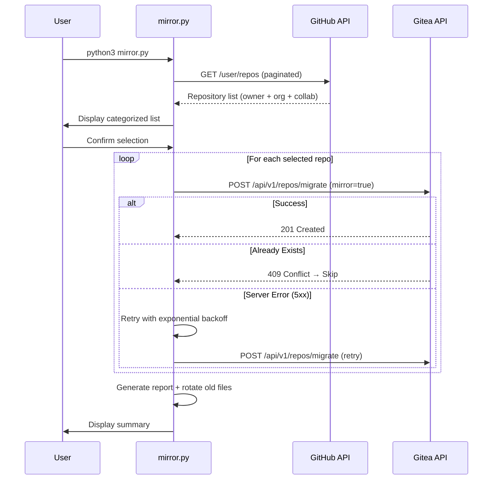

<div align="center">

# 🪞 Gitea GitHub Mirror

**Bulk mirror all your GitHub repositories to a self-hosted Gitea instance — fully automated.**

[](LICENSE)
[](https://python.org)
[](Dockerfile)
[](https://github.com/yuanweize/gitea-github-mirror/actions)

[English](#-overview) · [简体中文](#-概述)

---

*One command. All repos. Automatic pull-mirror. Disaster recovery solved.* ✨

</div>

## 📖 Overview

**Gitea GitHub Mirror** is a zero-dependency Python CLI tool that discovers every repository under your GitHub account — public, private, forked, organization, and collaborator repos — and creates **pull-mirror clones** on your self-hosted [Gitea](https://gitea.io) instance.

Once configured, Gitea will **automatically sync** from GitHub on a schedule (default: every 8 hours), keeping your self-hosted backup always up-to-date without any manual intervention.

### ✨ Key Features

| Feature | Description |
|---------|-------------|
| 🔍 **Auto-Discovery** | Scans all repos via GitHub API (owner + org + collaborator) |
| 🪞 **Pull Mirror** | Creates Gitea pull-mirrors that auto-sync periodically |
| 🌍 **Bilingual i18n** | Full English and 简体中文 interface |
| 🔄 **Retry + Backoff** | Exponential backoff on 5xx/timeout errors (configurable) |
| 📊 **Execution Reports** | Markdown reports with timing metrics, auto-archived |
| 📝 **Structured Logging** | Dual output: colored console + timestamped log files |
| 🐳 **Docker Ready** | Alpine-based image, Docker Compose, GitHub Actions CI/CD |
| 🔐 **Secure by Design** | `.env` file for secrets, non-root Docker user |
| 📁 **Auto-Rotation** | Old logs and reports are automatically pruned |
| ⚡ **Zero Dependencies** | Pure Python 3 stdlib — no `pip install` needed |

---

## 🚀 Quick Start

### Option 1: Run Directly (Recommended)

```bash
# 1. Clone
git clone https://github.com/yuanweize/gitea-github-mirror.git
cd gitea-github-mirror

# 2. Configure
cp .env.example .env
# Edit .env with your tokens and URLs (see Configuration below)

# 3. Run
python3 mirror.py
```

### Option 2: Docker

```bash
# 1. Configure
cp .env.example .env
# Edit .env

# 2. Run
docker compose up
```

### Option 3: Docker (One-liner)

```bash
docker run --rm \
  -e GITEA_URL=https://git.example.com \
  -e GITEA_TOKEN=your_gitea_token \
  -e GITEA_USER=your_gitea_user \
  -e GITHUB_TOKEN=your_github_token \
  -e GITHUB_USER=your_github_user \
  -v ./logs:/app/logs \
  -v ./reports:/app/reports \
  ghcr.io/yuanweize/gitea-github-mirror:latest
```

---

## ⚙️ Configuration

All configuration is done via environment variables. Copy `.env.example` to `.env` and fill in your values.

### Required Variables

| Variable | Description | Example |
|----------|-------------|---------|
| `GITEA_URL` | Your Gitea instance base URL | `https://git.example.com` |
| `GITEA_TOKEN` | Gitea API access token | `abc123...` |
| `GITEA_USER` | Gitea username (repo owner) | `myuser` |
| `GITHUB_TOKEN` | GitHub personal access token | `ghp_xxx...` |
| `GITHUB_USER` | GitHub username | `myuser` |

### Optional Variables

| Variable | Default | Description |
|----------|---------|-------------|
| `MIRROR_INTERVAL` | Server default | Sync interval (e.g., `8h0m0s`) |
| `MAX_RETRIES` | `3` | Max retry attempts per repo |
| `RETRY_DELAY` | `5` | Initial retry delay (seconds), uses exponential backoff |
| `LOG_LEVEL` | `INFO` | `DEBUG`, `INFO`, `WARNING`, `ERROR` |
| `REPORT_MAX_COUNT` | `50` | Max archived reports before auto-rotation |
| `LANG_MIRROR` | `en` | UI language: `en` or `cn` |

### Generating Tokens

<details>
<summary><strong>🔑 GitHub Token</strong></summary>

1. Go to [github.com/settings/tokens](https://github.com/settings/tokens)
2. Click **Generate new token (classic)**
3. Select scope: **`repo`** (full control — required for private repos)
4. Copy the generated token to `GITHUB_TOKEN` in your `.env`

</details>

<details>
<summary><strong>🔑 Gitea Token</strong></summary>

1. Go to `https://your-gitea-instance/user/settings/applications`
2. Under **Manage Access Tokens**, enter a token name
3. Click **Generate Token**
4. Copy the token to `GITEA_TOKEN` in your `.env`

</details>

---

## 📋 CLI Usage

```
usage: mirror.py [-h] [--lang {en,cn}] [--yes] [--include-orgs] [--dry-run]

Bulk mirror all GitHub repositories to a self-hosted Gitea instance.

options:
  -h, --help        show this help message and exit
  --lang {en,cn}    UI language (en/cn)
  --yes, -y         Skip all confirmation prompts
  --include-orgs    Include organization & collaborator repos
  --dry-run         Simulate without making any API calls to Gitea
```

### Examples

```bash
# Interactive mode (default) — lists repos, asks for confirmation
python3 mirror.py

# Chinese interface
python3 mirror.py --lang cn

# Non-interactive, owner repos only
python3 mirror.py --yes

# Include org repos, no prompts
python3 mirror.py --yes --include-orgs

# Dry run — preview what would happen without touching Gitea
python3 mirror.py --dry-run

# Combine options
python3 mirror.py --lang cn --yes --include-orgs
```

---

## 🏗️ Project Structure

```
gitea-github-mirror/
├── mirror.py                    # Main application (single-file, zero deps)
├── .env.example                 # Environment variable template
├── Dockerfile                   # Multi-stage Alpine Docker image
├── docker-compose.yml           # Docker Compose with optional scheduler
├── .gitignore                   # Git ignore rules
├── LICENSE                      # MIT License
├── README.md                    # This file
├── logs/                        # Runtime logs (auto-rotated, max 30 files)
│   └── mirror_20260527_134500.log
├── reports/                     # Execution reports (auto-rotated, max 50 files)
│   └── report_20260527_134500.md
└── .github/
    └── workflows/
        └── docker-publish.yml   # CI/CD: Build & push to GHCR
```

---

## 🔄 How It Works



After initial setup, **Gitea handles ongoing sync automatically**:

```
GitHub ──(push)──> GitHub Repo
                        │
                   (every 8h)
                        │
                        ▼
                   Gitea Mirror ──(pull)──> Up-to-date backup
```

---

## 📊 Execution Reports

After each run, a Markdown report is generated in the `reports/` directory:

```markdown
# 📊 Execution Report

**Date:** 2026-05-27 14:30:00
**Version:** v1.0.0

## Summary

| Metric              | Value |
|---------------------|-------|
| Total repos         | 196   |
| Successfully mirrored | 190 |
| Already existed     | 4     |
| Failed              | 2     |
| Total duration      | 5m 32s |
| Avg time per repo   | 1.7s  |

## ❌ Failed Repositories

- `large-repo`: HTTP 504: Gateway Timeout
- `broken-repo`: HTTP 422: Unprocessable Entity
```

Reports are **auto-rotated**: when the count exceeds `REPORT_MAX_COUNT` (default 50), the oldest reports are automatically deleted to prevent disk overflow.

---

## 🐳 Docker

### Build Locally

```bash
docker build -t gitea-github-mirror .
docker run --rm --env-file .env \
  -v ./logs:/app/logs \
  -v ./reports:/app/reports \
  gitea-github-mirror
```

### Use Pre-built Image from GHCR

```bash
docker pull ghcr.io/yuanweize/gitea-github-mirror:latest
```

### Scheduled Runs with Docker Compose

Uncomment the `scheduler` service in `docker-compose.yml` to run mirrors on a cron schedule (e.g., every 6 hours) using [ofelia](https://github.com/mcuadros/ofelia).

---

## 📚 API Reference

This tool interacts with two REST APIs:

### GitHub REST API v3

| Endpoint | Method | Purpose | Docs |
|----------|--------|---------|------|
| `/user/repos` | `GET` | List authenticated user's repositories | [Docs](https://docs.github.com/en/rest/repos/repos#list-repositories-for-the-authenticated-user) |

**Key Parameters:**
- `affiliation=owner,collaborator,organization_member` — Fetch all accessible repos
- `per_page=100` — Maximum page size for pagination

### Gitea API v1

| Endpoint | Method | Purpose | Docs |
|----------|--------|---------|------|
| `/api/v1/repos/migrate` | `POST` | Create a repository migration/mirror | [Swagger](https://gitea.com/api/swagger#/repository/repoMigrate) |

**Key Payload Fields:**

```json
{
  "auth_token": "github_pat_xxx",
  "clone_addr": "https://github.com/user/repo.git",
  "mirror": true,
  "repo_name": "repo",
  "repo_owner": "gitea_user",
  "private": true,
  "service": "github"
}
```

**Full API Documentation:**
- GitHub: https://docs.github.com/en/rest
- Gitea: https://docs.gitea.com/api/1.25/
- Gitea Mirror Docs: https://docs.gitea.com/usage/repo-mirror

---

## 🛡️ Error Handling & Resilience

| Scenario | Behavior |
|----------|----------|
| **Network timeout** | Retry with exponential backoff (5s → 10s → 20s) |
| **HTTP 5xx** | Retry up to `MAX_RETRIES` times |
| **HTTP 429 (Rate limit)** | Retry with backoff |
| **HTTP 409 (Exists)** | Skip gracefully, count as "skipped" |
| **HTTP 422 (Invalid)** | Fail immediately, no retry |
| **Ctrl+C** | Graceful exit |

---

## 📖 概述

**Gitea GitHub Mirror** 是一个零依赖的 Python 命令行工具，可以自动发现您 GitHub 账号下的所有仓库（公开、私有、Fork、组织成员和协作者），并在您自建的 [Gitea](https://gitea.io) 服务器上创建**拉取镜像**。

配置完成后，Gitea 会**自动定期从 GitHub 同步**（默认每 8 小时），保证您的自托管备份始终是最新的，无需任何手动操作。

### 快速开始

```bash
# 克隆项目
git clone https://github.com/yuanweize/gitea-github-mirror.git
cd gitea-github-mirror

# 配置环境变量
cp .env.example .env
# 编辑 .env 填入您的 Token 和 URL

# 使用中文界面运行
python3 mirror.py --lang cn
```

详细配置和用法请参阅上方英文文档。所有 CLI 命令和功能完全一致。

---

## 📄 License

[MIT](LICENSE) © 2026 [yuanweize](https://github.com/yuanweize)
