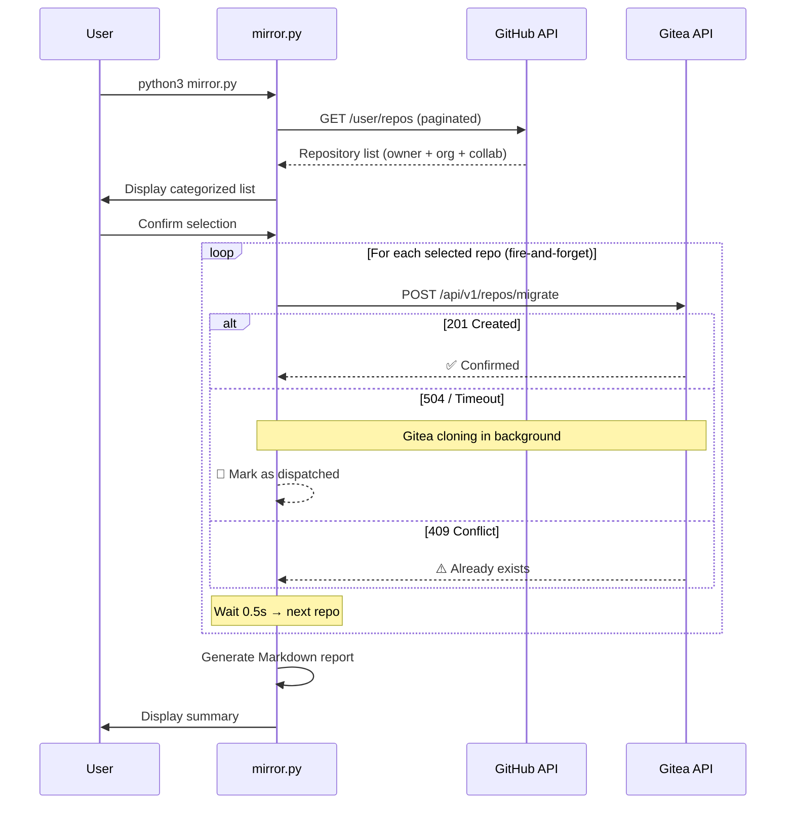

<div align="center">

# 🪞 Gitea GitHub Mirror

**Bulk mirror all your GitHub repositories to a self-hosted Gitea instance — fully automated.**

[](LICENSE)
[](https://python.org)
[](Dockerfile)
[](https://github.com/yuanweize/gitea-github-mirror/actions)

[English](#-overview) · [简体中文](#-概述)

---

*One command. All repos. Automatic pull-mirror. Disaster recovery solved.* ✨

</div>

---

## 📖 Overview

**Gitea GitHub Mirror** is a zero-dependency Python CLI tool that discovers every repository under your GitHub account — public, private, forked, organization, and collaborator repos — and creates **pull-mirror clones** on your self-hosted [Gitea](https://gitea.io) instance.

Once configured, Gitea will **automatically sync** from GitHub on a schedule (default: every 8 hours), keeping your self-hosted backup always up-to-date without any manual intervention.

### ✨ Key Features

| Feature | Description |
|---------|-------------|
| 🔍 **Auto-Discovery** | Scans all repos via GitHub API (owner + org + collaborator) |
| 🪞 **Pull Mirror** | Creates Gitea pull-mirrors that auto-sync periodically |
| 🚀 **Fire-and-Forget** | Dispatches requests without blocking on large repo clones — avoids Nginx 504 timeouts |
| 🌍 **Bilingual i18n** | Full English and 简体中文 interface |
| 🔄 **Retry + Backoff** | Exponential backoff on transient errors (configurable) |
| 📊 **Execution Reports** | Markdown reports with timing metrics, auto-archived |
| 📝 **Structured Logging** | Dual output: colored console + timestamped log files |
| 🐳 **Docker Ready** | Alpine-based image, Docker Compose, GitHub Actions CI/CD |
| 🔐 **Secure by Design** | `.env` file for secrets, non-root Docker user |
| 📁 **Auto-Rotation** | Old logs (max 30) and reports (max 50) are automatically pruned |
| ⚡ **Zero Dependencies** | Pure Python 3 stdlib — no `pip install` needed |

---

## 🚀 Quick Start

### Option 1: Run Directly (Recommended for first-time use)

```bash
# 1. Clone
git clone https://github.com/yuanweize/gitea-github-mirror.git
cd gitea-github-mirror

# 2. Configure
cp .env.example .env
# Edit .env with your tokens and URLs (see Configuration below)

# 3. Run (interactive mode)
python3 mirror.py

# 3a. Or run non-interactively
python3 mirror.py --yes
```

### Option 2: Docker Compose (Recommended for persistent deployment)

```bash
# 1. Clone and configure
git clone https://github.com/yuanweize/gitea-github-mirror.git
cd gitea-github-mirror
cp .env.example .env
# Edit .env

# 2a. Run in foreground (see live output)
docker compose up

# 2b. Run in background (detached / persistent)
docker compose up -d

# 3. Check logs when running in background
docker compose logs -f
```

### Option 3: Docker (One-liner)

```bash
# Foreground (see output directly)
docker run --rm \
  --env-file .env \
  -v ./logs:/app/logs \
  -v ./reports:/app/reports \
  ghcr.io/yuanweize/gitea-github-mirror:latest

# Background (persistent, detached)
docker run -d --name gitea-mirror \
  --restart unless-stopped \
  --env-file .env \
  -v ./logs:/app/logs \
  -v ./reports:/app/reports \
  ghcr.io/yuanweize/gitea-github-mirror:latest
```

---

## ⚙️ Configuration

All configuration is done via environment variables. Copy `.env.example` to `.env` and fill in your values.

### Required Variables

| Variable | Description | Example |
|----------|-------------|---------|
| `GITEA_URL` | Your Gitea instance base URL | `https://git.example.com` |
| `GITEA_TOKEN` | Gitea API access token | `abc123...` |
| `GITEA_USER` | Gitea username (repo owner) | `myuser` |
| `GITHUB_TOKEN` | GitHub personal access token | `ghp_xxx...` |
| `GITHUB_USER` | GitHub username | `myuser` |

### Optional Variables

| Variable | Default | Description |
|----------|---------|-------------|
| `MIRROR_INTERVAL` | Server default | Sync interval (e.g., `8h0m0s`) |
| `REQUEST_TIMEOUT` | `15` | HTTP timeout per request (seconds). Short by design — see [Fire-and-Forget](#-fire-and-forget-pattern) |
| `MAX_RETRIES` | `3` | Max retry attempts per repo |
| `RETRY_DELAY` | `5` | Initial retry delay (seconds), exponential backoff |
| `DISPATCH_DELAY` | `0.5` | Delay between consecutive dispatches (seconds) |
| `LOG_LEVEL` | `INFO` | `DEBUG`, `INFO`, `WARNING`, `ERROR` |
| `REPORT_MAX_COUNT` | `50` | Max archived reports before auto-rotation |
| `LANG_MIRROR` | `en` | UI language: `en` or `cn` |

### Generating Tokens

<details>
<summary><strong>🔑 GitHub Token</strong></summary>

1. Go to [github.com/settings/tokens](https://github.com/settings/tokens)
2. Click **Generate new token (classic)**
3. Select scope: **`repo`** (full control — required for private repos)
4. Copy the generated token to `GITHUB_TOKEN` in your `.env`

</details>

<details>
<summary><strong>🔑 Gitea Token</strong></summary>

1. Go to `https://your-gitea-instance/user/settings/applications`
2. Under **Manage Access Tokens**, enter a token name
3. Click **Generate Token**
4. Copy the token to `GITEA_TOKEN` in your `.env`

</details>

---

## 📋 CLI Usage

```
usage: mirror.py [-h] [--lang {en,cn}] [--yes] [--include-orgs] [--dry-run] [--timeout SECONDS]

Bulk mirror all GitHub repositories to a self-hosted Gitea instance.

options:
  -h, --help            show this help message and exit
  --lang {en,cn}        UI language (en/cn)
  --yes, -y             Skip all confirmation prompts
  --include-orgs        Include organization & collaborator repos
  --dry-run             Simulate without making any API calls to Gitea
  --timeout SECONDS     HTTP request timeout in seconds (default: 15)
```

### Examples

```bash
# Interactive mode (default) — lists repos, asks for confirmation
python3 mirror.py

# Chinese interface
python3 mirror.py --lang cn

# Non-interactive, owner repos only
python3 mirror.py --yes

# Include org repos, no prompts, Chinese UI
python3 mirror.py --yes --include-orgs --lang cn

# Dry run — preview what would happen without touching Gitea
python3 mirror.py --dry-run

# Custom timeout (e.g. for servers without reverse proxy)
python3 mirror.py --timeout 120
```

---

## 🏗️ Project Structure

```
gitea-github-mirror/
├── mirror.py                    # Main application (single-file, zero deps)
├── .env.example                 # Environment variable template
├── Dockerfile                   # Minimal Alpine-based Docker image
├── docker-compose.yml           # Docker Compose with optional cron scheduler
├── .gitignore                   # Git ignore rules
├── LICENSE                      # MIT License
├── README.md                    # Documentation (you are here)
├── logs/                        # Runtime logs (auto-rotated, max 30 files)
│   └── mirror_20260527_134500.log
├── reports/                     # Execution reports (auto-rotated, max 50 files)
│   └── report_20260527_134500.md
└── .github/
    └── workflows/
        └── docker-publish.yml   # CI/CD: auto-build & push to GHCR
```

---

## 🚀 Fire-and-Forget Pattern

A core design decision of this tool. Here's why and how:

### The Problem

When you create a pull-mirror via `POST /api/v1/repos/migrate`, Gitea starts cloning the source repo **during the HTTP request**. For large repositories with extensive commit history, this can take minutes. If your Gitea sits behind a reverse proxy (Nginx, Caddy, Traefik, etc.), the proxy will typically enforce a 60-second timeout and return a `504 Gateway Timeout` error.

**But Gitea has already accepted the task!** It spawns a background goroutine to continue cloning even after the HTTP connection is severed. The mirror will be created successfully — the 504 is a false alarm.

### The Solution

This tool uses a **short HTTP timeout** (default: 15 seconds) and treats timeout responses as "dispatched":

```
HTTP 201 Created     → ✅ Confirmed created
HTTP 504/502         → 📨 Dispatched (server processing in background)
Socket timeout       → 📨 Dispatched (server processing in background)
HTTP 409 Conflict    → ⚠️  Already exists, skipped
HTTP 422             → ❌ Invalid request, failed
Other 5xx            → 🔄 Retry with exponential backoff
```

This means 196 repos can be dispatched in under 2 minutes instead of 30+ minutes.

---

## 🔄 How It Works



**After initial setup, Gitea handles ongoing sync automatically:**

```
You push to GitHub ──> GitHub Repo
                            │
                       (every 8h, automatic)
                            │
                            ▼
                       Gitea Mirror ──> Always up-to-date backup
```

---

## 📊 Execution Reports

After each run, a Markdown report is generated in the `reports/` directory:

```markdown
# 📊 Execution Report

**Date:** 2026-05-27 14:30:00
**Version:** v1.1.0
**Mode:** Fire-and-Forget (async dispatch)

## Summary

| Metric                  | Value  |
|-------------------------|--------|
| Total repos processed   | 196    |
| Confirmed created       | 180    |
| Dispatched (background) | 12     |
| Already existed         | 2      |
| Failed                  | 2      |
| Total duration          | 1m 48s |
| Avg time per repo       | 0.6s   |

## ❌ Failed Repositories

- `broken-repo`: HTTP 422: Unprocessable Entity
```

Reports are **auto-rotated**: when the count exceeds `REPORT_MAX_COUNT` (default 50), the oldest reports are automatically deleted to prevent disk overflow.

---

## 🐳 Docker

### Build Locally

```bash
docker build -t gitea-github-mirror .

# Run (foreground)
docker run --rm --env-file .env \
  -v ./logs:/app/logs \
  -v ./reports:/app/reports \
  gitea-github-mirror

# Run (background, persistent)
docker run -d --name gitea-mirror \
  --restart unless-stopped \
  --env-file .env \
  -v ./logs:/app/logs \
  -v ./reports:/app/reports \
  gitea-github-mirror
```

### Use Pre-built Image from GHCR

```bash
docker pull ghcr.io/yuanweize/gitea-github-mirror:latest
```

### Scheduled Runs with Docker Compose

Uncomment the `scheduler` service in `docker-compose.yml` to run mirrors on a cron schedule (e.g., every 6 hours) using [ofelia](https://github.com/mcuadros/ofelia).

---

## 📚 API Reference

This tool interacts with two REST APIs:

### GitHub REST API v3

| Endpoint | Method | Purpose | Docs |
|----------|--------|---------|------|
| `/user/repos` | `GET` | List authenticated user's repositories | [GitHub Docs](https://docs.github.com/en/rest/repos/repos#list-repositories-for-the-authenticated-user) |

**Key Parameters:**
- `affiliation=owner,collaborator,organization_member` — Fetch all accessible repos
- `per_page=100` — Maximum page size for pagination

### Gitea API v1

| Endpoint | Method | Purpose | Docs |
|----------|--------|---------|------|
| `/api/v1/repos/migrate` | `POST` | Create a repository migration/mirror | [Gitea Swagger](https://gitea.com/api/swagger#/repository/repoMigrate) |

**Key Payload Fields:**

```json
{
  "auth_token": "github_pat_xxx",
  "clone_addr": "https://github.com/user/repo.git",
  "mirror": true,
  "repo_name": "repo",
  "repo_owner": "gitea_user",
  "private": true,
  "service": "github",
  "mirror_interval": "8h0m0s"
}
```

**Full API Documentation:**
- GitHub REST API: https://docs.github.com/en/rest
- Gitea API (Swagger): https://docs.gitea.com/api/1.25/
- Gitea Mirror Docs: https://docs.gitea.com/usage/repo-mirror

---

## 🛡️ Error Handling & Resilience

| Scenario | Behavior |
|----------|----------|
| **HTTP 504 (Gateway Timeout)** | Treated as "dispatched" — Gitea is cloning in background |
| **HTTP 502 (Bad Gateway)** | Treated as "dispatched" — same rationale |
| **Socket timeout** | Treated as "dispatched" — request was accepted |
| **HTTP 5xx (other)** | Retry with exponential backoff (5s → 10s → 20s) |
| **HTTP 429 (Rate limit)** | Retry with backoff |
| **HTTP 409 (Conflict)** | Skip gracefully, count as "skipped" |
| **HTTP 422 (Unprocessable)** | Fail immediately, no retry |
| **Connection refused** | Retry with backoff |
| **Ctrl+C** | Graceful exit |

---

## 📖 概述

**Gitea GitHub Mirror** 是一个零依赖的 Python 命令行工具，可以自动发现您 GitHub 账号下的所有仓库（公开、私有、Fork、组织和协作者仓库），并在您自建的 [Gitea](https://gitea.io) 服务器上创建**拉取镜像 (Pull Mirror)**。

配置完成后，Gitea 会**自动定期从 GitHub 同步**（默认每 8 小时），保证您的自托管备份始终是最新的，无需任何手动操作。

### ✨ 核心特性

| 特性 | 说明 |
|------|------|
| 🔍 **自动发现** | 通过 GitHub API 扫描所有仓库（个人 + 组织 + 协作者） |
| 🪞 **拉取镜像** | 创建 Gitea Pull Mirror，定期自动从 GitHub 拉取更新 |
| 🚀 **触发即走** | 采用 Fire-and-Forget 模式下发请求，彻底规避 Nginx 504 超时 |
| 🌍 **双语界面** | 完整的英文和简体中文界面支持 |
| 🔄 **自动重试** | 瞬态错误自动指数退避重试（可配置次数和延迟） |
| 📊 **执行报告** | 每次运行后自动生成 Markdown 格式的详细报告（含耗时、成功/失败统计） |
| 📝 **结构化日志** | 控制台 + 日志文件双输出，带时间戳 |
| 🐳 **容器化** | Alpine Docker 镜像 + Docker Compose + GitHub Actions 自动构建 |
| 🔐 **安全设计** | 敏感信息通过 `.env` 配置，Docker 非 root 用户运行 |
| 📁 **自动轮转** | 日志（最多 30 个）和报告（最多 50 个）自动清理，防止磁盘溢出 |
| ⚡ **零依赖** | 纯 Python 3 标准库，无需 `pip install` |

### 🚀 快速开始

```bash
# 克隆项目
git clone https://github.com/yuanweize/gitea-github-mirror.git
cd gitea-github-mirror

# 配置环境变量
cp .env.example .env
# 编辑 .env 填入您的 Token 和 URL

# 使用中文界面运行（交互模式）
python3 mirror.py --lang cn

# 使用中文界面运行（非交互模式，自动确认）
python3 mirror.py --lang cn --yes

# 使用 Docker Compose（前台运行，查看实时输出）
docker compose up

# 使用 Docker Compose（后台持久运行）
docker compose up -d
```

### ⚙️ 配置说明

| 变量名 | 必填 | 默认值 | 说明 |
|--------|------|--------|------|
| `GITEA_URL` | ✅ | — | 您的 Gitea 实例地址 |
| `GITEA_TOKEN` | ✅ | — | Gitea API 访问令牌 |
| `GITEA_USER` | ✅ | — | Gitea 用户名（镜像仓库的所有者） |
| `GITHUB_TOKEN` | ✅ | — | GitHub 个人访问令牌（需要 `repo` 权限） |
| `GITHUB_USER` | ✅ | — | GitHub 用户名 |
| `MIRROR_INTERVAL` | — | 服务器默认 | 同步间隔（如 `8h0m0s`） |
| `REQUEST_TIMEOUT` | — | `15` | 单次 HTTP 请求超时（秒） |
| `MAX_RETRIES` | — | `3` | 每个仓库的最大重试次数 |
| `RETRY_DELAY` | — | `5` | 初始重试延迟（秒），指数退避 |
| `DISPATCH_DELAY` | — | `0.5` | 连续请求间的延迟（秒） |
| `LOG_LEVEL` | — | `INFO` | 日志级别 |
| `REPORT_MAX_COUNT` | — | `50` | 最大报告存档数量 |
| `LANG_MIRROR` | — | `en` | 界面语言：`en` 或 `cn` |

### 🔥 Fire-and-Forget 模式

**解决的问题：** 当 Gitea 通过 `POST /api/v1/repos/migrate` 接收到镜像请求后，它会在 HTTP 请求期间开始执行 `git clone`。对于 Commit 历史较长或体积较大的仓库，克隆时间可能超过反向代理（Nginx/Caddy/Traefik）的超时限制（通常 60 秒），导致返回 `504 Gateway Timeout`。

**关键事实：** Gitea 的后台协程队列已经接受了任务，即使 HTTP 连接被 Nginx 切断，克隆仍会继续执行并最终成功。

**本工具的策略：**
- 使用短超时（默认 15 秒）快速下发请求
- `504`/`502`/`Socket Timeout` 均视为"已下发"（📨），不视为失败
- 仅 `422`（请求无效）才判定为真正失败
- 196 个仓库的请求下发可在 2 分钟内完成，而非 30 分钟以上

### 📋 命令行参数

```bash
python3 mirror.py --help

# 完整参数列表：
#   --lang {en,cn}     界面语言
#   --yes, -y          跳过所有确认提示
#   --include-orgs     包含组织和协作者仓库
#   --dry-run          模拟运行，不实际调用 Gitea API
#   --timeout SECONDS  自定义 HTTP 超时时间
```

所有 CLI 命令和功能与英文版完全一致，详细的 API 文档、架构图和错误处理策略请参阅上方英文文档。

---

## 📄 License

[MIT](LICENSE) © 2026 [yuanweize](https://github.com/yuanweize)
