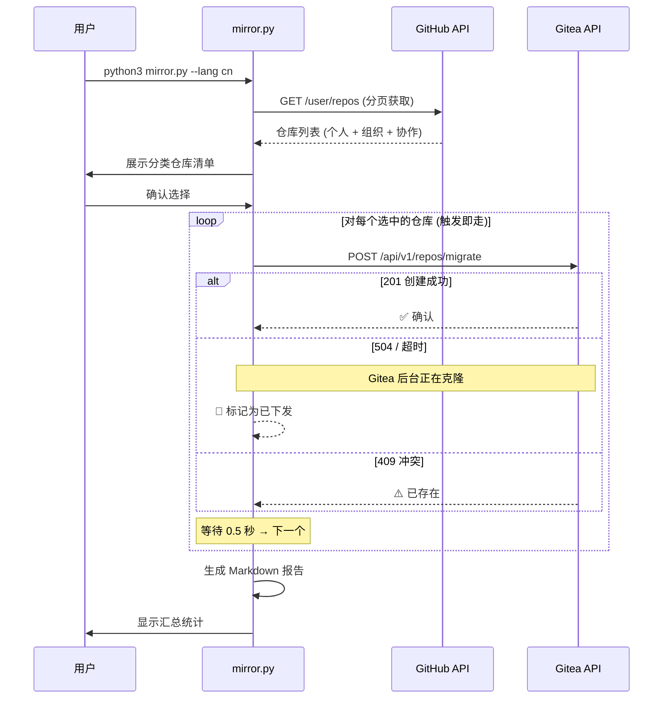

<div align="center">

# 🪞 Gitea GitHub Mirror

**将您 GitHub 上的所有仓库批量镜像到自建 Gitea 服务器 — 全自动化。**

[](LICENSE)
[](https://python.org)
[](Dockerfile)
[](https://github.com/yuanweize/gitea-github-mirror/actions)

[English](README.md) · **简体中文**

---

*一条命令，全部仓库，自动拉取镜像，灾备问题一步解决。* ✨

</div>

---

## 📖 概述

**Gitea GitHub Mirror** 是一个零依赖的 Python 命令行工具，可以自动发现您 GitHub 账号下的所有仓库（公开、私有、Fork、组织和协作者仓库），并在您自建的 [Gitea](https://gitea.io) 服务器上创建**拉取镜像 (Pull Mirror)**。

配置完成后，Gitea 会**自动定期从 GitHub 同步**（默认每 8 小时），保证您的自托管备份始终是最新的，无需任何手动操作。

---

## ✨ 核心特性

| 特性 | 说明 |
|------|------|
| 🔍 **自动发现** | 通过 GitHub API 扫描所有仓库（个人 + 组织 + 协作者） |
| 🪞 **拉取镜像** | 创建 Gitea Pull Mirror，定期自动从 GitHub 拉取更新 |
| 🚀 **触发即走** | 采用 Fire-and-Forget 模式下发请求，彻底规避 Nginx 504 超时 |
| 🌍 **双语界面** | 完整的英文和简体中文界面支持 |
| 🔄 **自动重试** | 瞬态错误自动指数退避重试（可配置次数和延迟） |
| 📊 **执行报告** | 每次运行后自动生成 Markdown 格式的详细报告（含耗时、成功/失败统计） |
| 📝 **结构化日志** | 控制台 + 日志文件双输出，带时间戳 |
| 🐳 **容器化** | Alpine Docker 镜像 + Docker Compose + GitHub Actions 自动构建 |
| 🔐 **安全设计** | 敏感信息通过 `.env` 配置，Docker 非 root 用户运行 |
| 📁 **自动轮转** | 日志（最多 30 个）和报告（最多 50 个）自动清理，防止磁盘溢出 |
| ⚡ **零依赖** | 纯 Python 3 标准库，无需 `pip install` |

---

## 🚀 快速开始

### 方式一：直接运行（推荐首次使用）

```bash
# 1. 克隆项目
git clone https://github.com/yuanweize/gitea-github-mirror.git
cd gitea-github-mirror

# 2. 配置环境变量
cp .env.example .env
# 编辑 .env 填入您的 Token 和 URL（参见下方「配置说明」）

# 3. 运行（交互模式，中文界面）
python3 mirror.py --lang cn

# 3a. 运行（非交互模式，自动确认）
python3 mirror.py --lang cn --yes
```

### 方式二：Docker Compose（推荐持久化部署）

```bash
# 1. 克隆并配置
git clone https://github.com/yuanweize/gitea-github-mirror.git
cd gitea-github-mirror
cp .env.example .env
# 编辑 .env

# 2a. 前台运行（查看实时输出）
docker compose up

# 2b. 后台运行（持久化/守护模式）
docker compose up -d

# 3. 后台运行时查看日志
docker compose logs -f
```

### 方式三：Docker 单行命令

```bash
# 前台运行
docker run --rm \
  --env-file .env \
  -v ./logs:/app/logs \
  -v ./reports:/app/reports \
  ghcr.io/yuanweize/gitea-github-mirror:latest

# 后台持久运行
docker run -d --name gitea-mirror \
  --restart unless-stopped \
  --env-file .env \
  -v ./logs:/app/logs \
  -v ./reports:/app/reports \
  ghcr.io/yuanweize/gitea-github-mirror:latest
```

---

## ⚙️ 配置说明

所有配置通过环境变量完成。请将 `.env.example` 复制为 `.env` 并填入您的值。

### 必填变量

| 变量名 | 说明 | 示例 |
|--------|------|------|
| `GITEA_URL` | 您的 Gitea 实例地址（不带末尾斜杠） | `https://git.example.com` |
| `GITEA_TOKEN` | Gitea API 访问令牌 | `abc123...` |
| `GITEA_USER` | Gitea 用户名（镜像仓库的所有者） | `myuser` |
| `GITHUB_TOKEN` | GitHub 个人访问令牌（需要 `repo` 权限） | `ghp_xxx...` |
| `GITHUB_USER` | GitHub 用户名 | `myuser` |

### 可选变量

| 变量名 | 默认值 | 说明 |
|--------|--------|------|
| `MIRROR_INTERVAL` | 服务器默认 | 同步间隔（如 `8h0m0s`） |
| `REQUEST_TIMEOUT` | `15` | 单次 HTTP 请求超时秒数。故意设短——参见 [触发即走模式](#-触发即走-fire-and-forget-模式) |
| `MAX_RETRIES` | `3` | 每个仓库的最大重试次数 |
| `RETRY_DELAY` | `5` | 初始重试延迟（秒），采用指数退避 |
| `DISPATCH_DELAY` | `0.5` | 连续请求间的延迟（秒） |
| `LOG_LEVEL` | `INFO` | 日志级别：`DEBUG`、`INFO`、`WARNING`、`ERROR` |
| `REPORT_MAX_COUNT` | `50` | 最大报告存档数量，超出自动清理旧报告 |
| `LANG_MIRROR` | `en` | 界面语言：`en` 或 `cn` |

### 获取令牌 (Token)

<details>
<summary><strong>🔑 GitHub Token 获取方法</strong></summary>

1. 前往 [github.com/settings/tokens](https://github.com/settings/tokens)
2. 点击 **Generate new token (classic)**
3. 勾选权限范围：**`repo`**（完全控制——访问私有仓库必须勾选）
4. 生成后，将 Token 复制到 `.env` 文件的 `GITHUB_TOKEN` 字段

</details>

<details>
<summary><strong>🔑 Gitea Token 获取方法</strong></summary>

1. 登录您的 Gitea 实例，进入 `设置 -> 应用`
2. 在 **管理访问令牌** 区域，输入令牌名称
3. 点击 **生成令牌**
4. 将令牌复制到 `.env` 文件的 `GITEA_TOKEN` 字段

</details>

---

## 📋 命令行参数

```
用法: mirror.py [-h] [--lang {en,cn}] [--yes] [--include-orgs] [--dry-run] [--timeout SECONDS]

将 GitHub 上的所有仓库批量镜像到自建 Gitea 实例。

参数:
  -h, --help            显示帮助信息
  --lang {en,cn}        界面语言 (en=英文, cn=中文)
  --yes, -y             跳过所有确认提示，全自动执行
  --include-orgs        包含组织和协作者仓库
  --dry-run             模拟运行，不实际调用 Gitea API
  --timeout SECONDS     自定义 HTTP 请求超时时间（秒，默认 15）
```

### 使用示例

```bash
# 交互模式（默认）——列出仓库清单，逐步确认
python3 mirror.py --lang cn

# 非交互模式，仅同步个人仓库
python3 mirror.py --lang cn --yes

# 包含组织仓库，全自动
python3 mirror.py --lang cn --yes --include-orgs

# 模拟运行——预览操作，不实际请求 Gitea
python3 mirror.py --lang cn --dry-run

# 自定义超时（适用于没有反向代理的服务器）
python3 mirror.py --lang cn --timeout 120
```

---

## 🏗️ 项目结构

```
gitea-github-mirror/
├── mirror.py                    # 主程序（单文件，零依赖）
├── .env.example                 # 环境变量模板
├── Dockerfile                   # 轻量级 Alpine Docker 镜像
├── docker-compose.yml           # Docker Compose（含可选定时调度器）
├── .gitignore                   # Git 忽略规则
├── LICENSE                      # MIT 开源协议
├── README.md                    # 英文文档
├── README_CN.md                 # 中文文档（本文件）
├── logs/                        # 运行日志（自动轮转，最多 30 个）
│   └── mirror_20260527_134500.log
├── reports/                     # 执行报告（自动轮转，最多 50 个）
│   └── report_20260527_134500.md
└── .github/
    └── workflows/
        └── docker-publish.yml   # CI/CD：自动构建并推送到 GHCR
```

---

## 🔥 触发即走 (Fire-and-Forget) 模式

这是本工具最核心的设计决策。

### 问题背景

当您通过 `POST /api/v1/repos/migrate` 向 Gitea 发送镜像请求时，Gitea 会在 HTTP 请求期间开始执行 `git clone`。对于 Commit 历史较长或体积较大的仓库，克隆时间可能超过反向代理（Nginx/Caddy/Traefik）的超时限制（通常 60 秒），导致返回 `504 Gateway Timeout`。

### 关键事实

**Gitea 的后台协程队列已经接受了任务。** 即使 HTTP 连接被 Nginx 切断，克隆操作仍会在 Gitea 服务器后台继续执行，并最终成功完成。504 是一个"假报错"。

### 本工具的解决方案

使用短 HTTP 超时（默认 15 秒），快速下发请求，将耗时的下载工作全部甩给 Gitea 后台处理：

| HTTP 响应 | 处理策略 | 含义 |
|-----------|----------|------|
| `201 Created` | ✅ 确认创建 | API 在超时内返回了成功响应 |
| `504 Gateway Timeout` | 📨 已下发 | Nginx 超时，但 Gitea 后台正在处理 |
| `502 Bad Gateway` | 📨 已下发 | 同上 |
| `Socket Timeout` | 📨 已下发 | Python 层面超时，请求已到达服务器 |
| `409 Conflict` | ⚠️ 已存在 | 仓库已经在 Gitea 上了，跳过 |
| `422 Unprocessable` | ❌ 失败 | 请求无效（如仓库名非法），不重试 |
| 其他 `5xx` | 🔄 重试 | 指数退避重试（5s → 10s → 20s） |

**效果：** 196 个仓库的请求下发可在 **~2 分钟** 内完成，而非之前同步等待的 30 分钟以上。

---

## 🔄 工作原理



**初次配置完成后，Gitea 自动处理后续同步：**

```
您推送到 GitHub ──> GitHub 仓库
                        │
                   (每 8 小时自动拉取)
                        │
                        ▼
                   Gitea 镜像 ──> 始终最新的备份
```

---

## 📊 执行报告

每次运行后，自动在 `reports/` 目录生成 Markdown 格式的执行报告：

```markdown
# 📊 执行报告

**日期:** 2026-05-27 14:30:00
**版本:** v1.1.0
**模式:** Fire-and-Forget (异步下发)

## 汇总

| 指标           | 数值   |
|----------------|--------|
| 处理仓库总数   | 196    |
| 确认创建成功   | 180    |
| 已下发(后台中) | 12     |
| 已存在(跳过)   | 2      |
| 失败           | 2      |
| 总耗时         | 1m 48s |
| 平均每仓库     | 0.6s   |

## ❌ 失败仓库列表

- `broken-repo`: HTTP 422: Unprocessable Entity
```

报告会**自动轮转**：当数量超过 `REPORT_MAX_COUNT`（默认 50）时，最旧的报告会被自动删除，防止硬盘溢出。

---

## 🛡️ 错误处理策略

| 场景 | 行为 |
|------|------|
| **HTTP 504 (网关超时)** | 视为"已下发"——Gitea 后台正在克隆 |
| **HTTP 502 (网关错误)** | 视为"已下发"——同上 |
| **Socket 超时** | 视为"已下发"——请求已到达服务器 |
| **其他 HTTP 5xx** | 指数退避重试（5s → 10s → 20s） |
| **HTTP 429 (速率限制)** | 退避重试 |
| **HTTP 409 (冲突)** | 静默跳过，计入"已存在" |
| **HTTP 422 (无法处理)** | 直接判定失败，不重试 |
| **连接被拒** | 退避重试 |
| **Ctrl+C** | 优雅退出 |

---

## 📚 API 参考

本工具调用两个 REST API：

### GitHub REST API v3

| 端点 | 方法 | 用途 | 文档 |
|------|------|------|------|
| `/user/repos` | `GET` | 列出已认证用户的所有仓库 | [GitHub 文档](https://docs.github.com/en/rest/repos/repos#list-repositories-for-the-authenticated-user) |

### Gitea API v1

| 端点 | 方法 | 用途 | 文档 |
|------|------|------|------|
| `/api/v1/repos/migrate` | `POST` | 创建仓库迁移/镜像 | [Gitea Swagger](https://gitea.com/api/swagger#/repository/repoMigrate) |

**完整 API 文档：**
- GitHub REST API：https://docs.github.com/en/rest
- Gitea API (Swagger)：https://docs.gitea.com/api/1.25/
- Gitea 镜像功能文档：https://docs.gitea.com/usage/repo-mirror

---

## 📄 许可证

[MIT](LICENSE) © 2026 [yuanweize](https://github.com/yuanweize)
