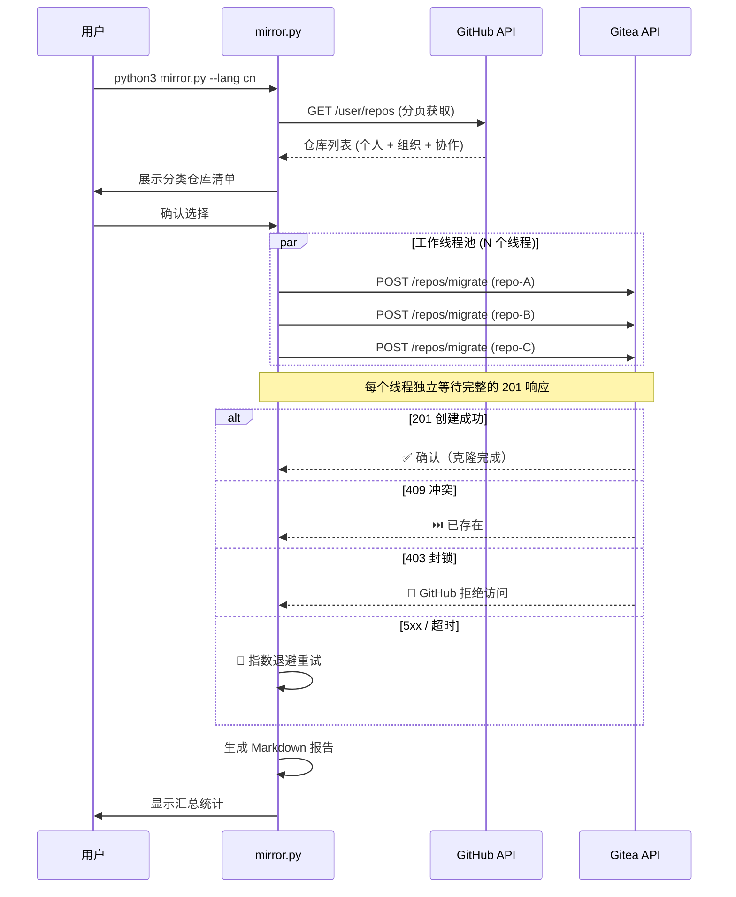

<div align="center">

# 🪞 Gitea GitHub Mirror

**将您 GitHub 上的所有仓库批量镜像到自建 Gitea 服务器 — 并发执行、严格校验、结果可靠。**

[](LICENSE)
[](https://python.org)
[](Dockerfile)
[](https://github.com/yuanweize/Gitea-GitHub-Mirror/pkgs/container/gitea-github-mirror)
[](https://github.com/yuanweize/Gitea-GitHub-Mirror/actions)
[](mirror.py)

[English](README.md) · **简体中文**

---

*一条命令，全部仓库，多线程并发，严格 201 校验，零误报。* ✨

</div>

---

## 📖 概述

**Gitea GitHub Mirror** 是一个零依赖的 Python 命令行工具，可以自动发现您 GitHub 账号下的所有仓库（公开、私有、Fork、组织和协作者仓库），并在您自建的 [Gitea](https://gitea.io) 服务器上创建**拉取镜像 (Pull Mirror)**。

配置完成后，Gitea 会**自动定期从 GitHub 同步**（默认每 8 小时），保证您的自托管备份始终是最新的，无需任何手动操作。

---

## ✨ 核心特性

| 特性 | 说明 |
|------|------|
| 🔍 **自动发现** | 通过 GitHub API 扫描所有仓库（个人 + 组织 + 协作者） |
| 🧲 **增量同步** | 跳过健康镜像，自动检测并修复损坏的空壳镜像 |
| 🔧 **镜像健康检查** | 检测迁移失败留下的空壳仓库并自动删除 |
| 🪞 **拉取镜像** | 创建 Gitea Pull Mirror，定期自动从 GitHub 拉取更新 |
| ⚡ **多线程并发** | 可配置 `MAX_WORKERS` 线程数，N 个仓库同时迁移 |
| ✅ **严格校验** | 只有 HTTP 201 = 成功，绝不猜测、绝不误报 |
| 🚫 **封锁仓库检测** | 自动识别 GitHub 403（DMCA/违规）并清晰跳过 |
| 🌍 **双语界面** | 完整的英文和简体中文界面支持 |
| 🔄 **自动重试** | 5xx 和网络错误自动指数退避重试 |
| 📊 **执行报告** | 每次运行后生成 Markdown 报告（含并发统计、耗时、成功/失败明细） |
| 📝 **结构化日志** | 线程安全的控制台 + 日志文件双输出 |
| 🐳 **容器化** | Alpine Docker 镜像 + Docker Compose + GitHub Actions 自动构建 |
| 🔐 **安全设计** | 敏感信息通过 `.env` 配置，Docker 非 root 用户运行 |
| 📁 **自动轮转** | 日志（最多 30 个）和报告（最多 50 个）自动清理 |
| ⚙️ **优雅关闭** | Ctrl+C 触发干净退出，完成当前任务后生成报告 |
| ⚡ **零依赖** | 纯 Python 3 标准库，无需 `pip install` |

> **💡 v2.4.0 亮点：** 严格的 GitHub 组织架构镜像 (PRESERVE_ORGS)、`SYNC_NOW` 立即触发老仓库同步，以及 `FORCE_RECREATE` 强制删除重建。

---

## 🚀 快速开始

### 🚀 哪种部署方式适合你？

| 方式 | 适用场景 | 需要服务器？ |
|------|----------|----------|
| 🐍 [直接运行](#方式一直接运行推荐首次使用) | 首次使用 / 快速测试 | 任何有 Python 3 的机器 |
| 🐳 [Docker Compose](#方式二docker-compose推荐持久化部署) | 自建服务器持久运行 | Docker 主机 |
| 📦 [Docker 单行](#方式三docker-单行命令) | 一次性容器化运行 | Docker 主机 |
| ☁️ [GitHub Actions](#方式四github-actions推荐全自动无人值守) | 全自动无服务器 | 无需（免费） |

### 方式一：直接运行（推荐首次使用）

```bash
# 1. 克隆项目
git clone https://github.com/yuanweize/gitea-github-mirror.git
cd gitea-github-mirror

# 2. 配置环境变量
cp .env.example .env
# 编辑 .env 填入您的 Token 和 URL（参见下方「配置说明」）

# 3. 运行（交互模式，中文界面）
python3 mirror.py --lang cn

# 3a. 运行（非交互模式，自动确认）
python3 mirror.py --lang cn --yes
```

### 方式二：Docker Compose（推荐持久化部署）

```bash
# 1. 克隆并配置
git clone https://github.com/yuanweize/gitea-github-mirror.git
cd gitea-github-mirror
cp .env.example .env
# 编辑 .env

# 2a. 前台运行（查看实时输出）
docker compose up

# 2b. 后台运行（持久化/守护模式）
docker compose up -d

# 3. 后台运行时查看日志
docker compose logs -f
```

### 方式三：Docker 单行命令

```bash
# 前台运行
docker run --rm \
  --env-file .env \
  -v ./logs:/app/logs \
  -v ./reports:/app/reports \
  ghcr.io/yuanweize/gitea-github-mirror:latest

# 后台持久运行
docker run -d --name gitea-mirror \
  --restart unless-stopped \
  --env-file .env \
  -v ./logs:/app/logs \
  -v ./reports:/app/reports \
  ghcr.io/yuanweize/gitea-github-mirror:latest
```

### 方式四：GitHub Actions（推荐全自动无人值守）

**无需任何服务器。** GitHub 按计划自动运行脚本。

1. **Fork 或克隆**本仓库到您的 GitHub 账号
2. **添加 Secrets：** 进入仓库 `Settings → Secrets and variables → Actions → New repository secret`

   | Secret 名称 | 值 |
   |-------------|----|
   | `GITEA_URL` | `https://git.example.com` |
   | `GITEA_TOKEN` | 您的 Gitea API 令牌 |
   | `GITEA_USER` | 您的 Gitea 用户名 |
   | `MIRROR_GITHUB_TOKEN` | 您的 GitHub PAT（需要 `repo` 权限） |
   | `GITHUB_USER` | 您的 GitHub 用户名 |
   | `SKIP_REPOS` | 以逗号分隔的忽略仓库名列表 (例如 `repo1,repo2`) |
   | `MIRROR_INTERVAL` | *(可选)* 如 `8h0m0s` |
   | `MIRROR_EXTRAS` | *(可选)* 设为 `true` 以同步 Issues、Wiki、标签和发布版 |
   | `PRESERVE_ORGS` | *(可选)* 设为 `true` 以自动在 Gitea 重建 GitHub 组织架构 |
   | `SYNC_NOW` | *(可选)* 设为 `true` 以立即触发已有仓库的拉取更新 |
   | `FORCE_RECREATE` | *(可选)* 设为 `true` 强制删除并在 Gitea 重建所有现有仓库（警告：极其危险！） |

   > **⚠️ 注意：** GitHub Token 的 Secret 名称必须是 `MIRROR_GITHUB_TOKEN`（而非 `GITHUB_TOKEN`），因为 `GITHUB_TOKEN` 是 GitHub Actions 的保留变量。

3. **运行方式：**
   - **手动触发：** 进入 `Actions` 标签页 → `Mirror Sync` → `Run workflow`
   - **自动运行：** 默认每周日 UTC 03:00 自动执行（可在工作流文件中自定义）

4. **查看结果：** 每次运行后，报告和日志会作为**工作流 Artifacts** 上传（分别保留 30 天和 7 天）

<details>
<summary><strong>📝 自定义运行计划</strong></summary>

编辑 `.github/workflows/mirror-sync.yml`，修改 cron 表达式：

```yaml
schedule:
  - cron: "0 3 * * 0"    # 每周日 03:00 UTC — 默认
  # - cron: "0 3 * * *"  # 每天 03:00 UTC
  # - cron: "0 */6 * * *" # 每 6 小时
```

</details>

---

## ⚙️ 配置说明

所有配置通过环境变量完成。请将 `.env.example` 复制为 `.env` 并填入您的值。

### 必填变量

| 变量名 | 说明 | 示例 |
|--------|------|------|
| `GITEA_URL` | 您的 Gitea 实例地址（不带末尾斜杠） | `https://git.example.com` |
| `GITEA_TOKEN` | Gitea API 访问令牌 | `abc123...` |
| `GITEA_USER` | Gitea 用户名（镜像仓库的所有者） | `myuser` |
| `GITHUB_TOKEN` | GitHub 个人访问令牌（需要 `repo` 权限） | `ghp_xxx...` |
| `GITHUB_USER` | GitHub 用户名 | `myuser` |

### 可选变量

| 变量名 | 默认值 | 说明 |
|--------|--------|------|
| `MIRROR_INTERVAL` | 服务器默认 | 同步间隔（如 `8h0m0s`） |
| `MIRROR_EXTRAS` | `false` | 同步 Issues、Wiki、标签和发布版（`true`/`false`） |
| `PRESERVE_ORGS` | `false` | 自动在 Gitea 中重建 GitHub 组织架构（`true`/`false`） |
| `SYNC_NOW` | `false` | 立即触发老仓库同步更新（`true`/`false`） |
| `FORCE_RECREATE` | `false` | 强制删除现有仓库并重新搬家（`true`/`false`，极为危险） |
| `MIRROR_LFS` | `false` | 迁移镜像时启用 Git LFS（`true`/`false`） |
| `NOTIFY_WEBHOOK` | *(空)* | 通知 Webhook 地址（Slack/Discord/Teams/飞书/钉钉/Telegram 等） |
| `NOTIFY_TYPE` | *(自动)* | 强制指定类型：`slack`、`discord`、`teams`、`feishu`、`dingtalk`、`telegram`、`generic` |
| `NOTIFY_CHAT_ID` | *(空)* | Telegram chat_id（Telegram 时必填） |
| `NOTIFY_ONLY_ON_FAILURE` | `false` | 仅在失败时发送通知（`true`/`false`） |
| `NOTIFY_INCLUDE_REPORT` | `false` | 通知中包含报告内容（`true`/`false`） |
| `MAX_WORKERS` | `5` | 并发工作线程数，每个线程独立等待 HTTP 201 |
| `REQUEST_TIMEOUT` | `600` | 单次 HTTP 请求超时秒数，必须足以覆盖最大仓库的克隆时间 |
| `MAX_RETRIES` | `3` | 每个仓库的最大重试次数（仅对瞬态错误） |
| `RETRY_DELAY` | `10` | 初始重试延迟（秒），指数退避 (10s → 20s → 40s) |
| `LOG_LEVEL` | `INFO` | 日志级别：`DEBUG`、`INFO`、`WARNING`、`ERROR` |
| `REPORT_MAX_COUNT` | `50` | 最大报告存档数量，超出自动清理旧报告 |
| `LANG_MIRROR` | `en` | 界面语言：`en` 或 `cn` |

### 获取令牌 (Token)

<details>
<summary><strong>🔑 GitHub Token 获取方法</strong></summary>

1. 前往 [github.com/settings/tokens](https://github.com/settings/tokens)
2. 点击 **Generate new token (classic)**
3. 勾选权限范围：**`repo`**（完全控制——访问私有仓库必须勾选）
4. 生成后，将 Token 复制到 `.env` 文件的 `GITHUB_TOKEN` 字段

</details>

<details>
<summary><strong>🔑 Gitea Token 获取方法</strong></summary>

1. 登录您的 Gitea 实例，进入 `设置 -> 应用`
2. 在 **管理访问令牌** 区域，输入令牌名称
3. 点击 **生成令牌**
4. 将令牌复制到 `.env` 文件的 `GITEA_TOKEN` 字段

</details>

---

## 📋 命令行参数

```
用法: mirror.py [-h] [--lang {en,cn}] [--yes] [--include-orgs] [--dry-run] [--timeout SECONDS]

将 GitHub 上的所有仓库批量镜像到自建 Gitea 实例。

参数:
  -h, --help            显示帮助信息
  --lang {en,cn}        界面语言 (en=英文, cn=中文)
  --yes, -y             跳过所有确认提示，全自动执行
  --include-orgs        包含组织和协作者仓库
  --dry-run             模拟运行，不实际调用 Gitea API
  --workers N           并发工作线程数（默认 5）
  --timeout SECONDS     HTTP 请求超时时间（秒，默认 600）
```

### 使用示例

```bash
# 交互模式（默认）——列出仓库清单，逐步确认
python3 mirror.py --lang cn

# 非交互模式，仅同步个人仓库
python3 mirror.py --lang cn --yes

# 包含组织仓库，全自动
python3 mirror.py --lang cn --yes --include-orgs

# 模拟运行——预览操作，不实际请求 Gitea
python3 mirror.py --lang cn --dry-run

# 10 个并发线程，更长超时
python3 mirror.py --lang cn --workers 10 --timeout 900
```

---

## 🏗️ 项目结构

```
gitea-github-mirror/
├── mirror.py                    # 主程序（单文件，零依赖）
├── .env.example                 # 环境变量模板
├── Dockerfile                   # 轻量级 Alpine Docker 镜像
├── docker-compose.yml           # Docker Compose（含可选定时调度器）
├── .gitignore                   # Git 忽略规则
├── LICENSE                      # MIT 开源协议
├── README.md                    # 英文文档
├── README_CN.md                 # 中文文档（本文件）
├── logs/                        # 运行日志（自动轮转，最多 30 个）
│   └── mirror_20260527_134500.log
├── reports/                     # 执行报告（自动轮转，最多 50 个）
│   └── report_20260527_134500.md
└── .github/
    └── workflows/
        ├── docker-publish.yml   # CI/CD：自动构建并推送到 GHCR
        └── mirror-sync.yml      # 定时/手动执行镜像同步
```

---

## ⚡ 并发模型

这是本工具最核心的架构设计。

### 问题背景

Gitea 的迁移 API（`POST /api/v1/repos/migrate`）是**同步阻塞**的——只有当完整的 `git clone` 完成后才会返回 HTTP 201。对于大型仓库，这可能需要几分钟。如果用单线程顺序执行，200 个仓库可能需要数小时。

### 解决方案：多线程工作池

本工具不会猜测结果或掩盖超时错误，而是通过**严格校验 + 并发执行**来解决速度问题：

- `ThreadPoolExecutor`（默认 5 个工作线程）并行处理仓库
- 每个线程独立发送请求并**等待完整的 HTTP 201 响应**
- 只有确认的 `201 Created` 才算成功——绝不猜测、绝不误报
- 5 个线程 × 600s 超时 = 5 个仓库在 Gitea 服务器上同时克隆

```
线程 1: ████████████████ repo-A (201 ✅ 45s)
线程 2: ██████████████████████████ repo-B (201 ✅ 120s)
线程 3: ████████ repo-C (409 ⏭️ 已存在)
线程 4: ████████████████████ repo-D (201 ✅ 80s)
线程 5: ██ repo-E (403 🚫 封锁)
```

### Nginx 超时配置

如果您的 Gitea 在 Nginx 后面，您**必须**增加代理超时时间以匹配：

```nginx
location / {
    proxy_read_timeout 600s;
    proxy_connect_timeout 60s;
    proxy_send_timeout 600s;
}
```

---

## 🔄 工作原理



**初次配置完成后，Gitea 自动处理后续同步：**

```
您推送到 GitHub ──> GitHub 仓库
                        │
                   (每 8 小时自动拉取)
                        │
                        ▼
                   Gitea 镜像 ──> 始终最新的备份
```

---

## 📊 执行报告

每次运行后，自动在 `reports/` 目录生成 Markdown 格式的执行报告：

```markdown
# 📊 执行报告

**日期:** 2026-05-27 14:30:00
**版本:** v2.4.0
**模式:** 并发同步 (Multi-threaded)

## 汇总

| 指标           | 数值   |
|----------------|--------|
| 处理仓库总数   | 196    |
| 确认创建成功   | 180    |
| 已存在(跳过)   | 12     |
| 失败           | 4      |
| 总耗时         | 8m 12s |

## ❌ 失败仓库列表

- `broken-repo`: HTTP 422: Unprocessable Entity
```

报告会**自动轮转**：当数量超过 `REPORT_MAX_COUNT`（默认 50）时，最旧的报告会被自动删除，防止硬盘溢出。

---

## 🛡️ 错误处理策略

| 场景 | 行为 |
|------|------|
| **HTTP 201** | ✅ 成功——唯一确认状态 |
| **HTTP 409 (冲突)** | ⏭️ 跳过——仓库已存在于 Gitea |
| **HTTP 403 + "访问封锁"** | 🚫 封锁——GitHub 拒绝访问 (DMCA/违规)，跳过不重试 |
| **HTTP 403 (其他)** | 🔄 重试——可能是临时权限问题 |
| **HTTP 422 + DNS 错误** | 🔄 重试——临时 DNS 解析失败 |
| **HTTP 422 (其他)** | ❌ 直接失败，不重试 |
| **HTTP 429 (限流)** | 🔄 自动指数退避重试以遵守 API 限制 |
| **HTTP 5xx + "含 451"** | 🚫 封锁——GitHub 451 被 Gitea 包装为 500，跳过不重试 |
| **HTTP 502/504 (网关)** | 🔄 指数退避重试 (10s → 20s → 40s) |
| **其他 HTTP 5xx** | 🔄 指数退避重试 |
| **Socket 超时** | 🔄 退避重试 |
| **连接被拒** | 🔄 退避重试 |
| **Ctrl+C** | ⚠️ 优雅关闭——完成当前任务后生成报告 |
| **失败后** | 🧹 自动清理——如果 Gitea 在克隆失败前已创建空壳，自动删除 |

### 🔧 镜像健康检查 (v2.2.0)

Gitea 的迁移 API 会在执行 `git clone` **之前**就创建数据库记录。如果克隆失败（DNS、超时、DMCA 451），仓库记录会以空壳形式残留。这会导致两个问题：

1. 脚本报告“失败”但仓库已存在于 Gitea
2. 重新运行时脚本看到“已存在”就永远跳过

**v2.2.0 通过三层防御解决这个问题：**

| 层级 | 时机 | 操作 |
|------|------|------|
| **第 1 层** | 迁移前 | 扫描 Gitea 中 `mirror=true AND empty=true` 的仓库并自动删除 |
| **第 2 层** | 迁移失败后 | 检查 Gitea 是否创建了空壳并立即删除 |
| **第 3 层** | 迁移成功后 | 确认收到 `201` 响应（已有的严格校验） |

---

## 📚 API 参考

本工具调用两个 REST API：

### GitHub REST API v3

| 端点 | 方法 | 用途 | 文档 |
|------|------|------|------|
| `/user/repos` | `GET` | 列出已认证用户的所有仓库 | [GitHub 文档](https://docs.github.com/en/rest/repos/repos#list-repositories-for-the-authenticated-user) |

### Gitea API v1

| 端点 | 方法 | 用途 | 文档 |
|------|------|------|------|
| `/api/v1/repos/migrate` | `POST` | 创建仓库迁移/镜像 | [Gitea Swagger](https://gitea.com/api/swagger#/repository/repoMigrate) |

**完整 API 文档：**
- GitHub REST API：https://docs.github.com/en/rest
- Gitea API (Swagger)：https://docs.gitea.com/api/1.25/
- Gitea 镜像功能文档：https://docs.gitea.com/usage/repo-mirror

## 🙏 鸣谢 / Acknowledgements

本项目的底层架构设计和部分核心灵感，深度借鉴并学习了 Gitea 社区中以下优秀的开源项目：

- [songtianlun/mirrorGit](https://github.com/songtianlun/mirrorGit) - 提供了自动化镜像脚本的底层结构启示。
- [jaedle/mirror-to-gitea](https://github.com/jaedle/mirror-to-gitea) - 启发了关于 Issues/Wiki 等全量元数据迁移的架构思路。
- [situ2001/gitea-bulk-migration](https://github.com/situ2001/gitea-bulk-migration) - 提供了批量发现和大规模并发迁移的思路。
- [jonasrosland/gitmirror](https://github.com/jonasrosland/gitmirror) - 启发了 `mirror-sync` 强制触发拉取的 API 机制。
- [dustin/gitmirror](https://github.com/dustin/gitmirror) - 提供了部分 Gitea 自动化的结构性概念。

我们向这些开源项目的原作者致以最诚挚的感谢，感谢他们为开源生态做出的卓越贡献！

---

## 📄 许可证

[MIT](LICENSE) © 2026 [yuanweize](https://github.com/yuanweize)
